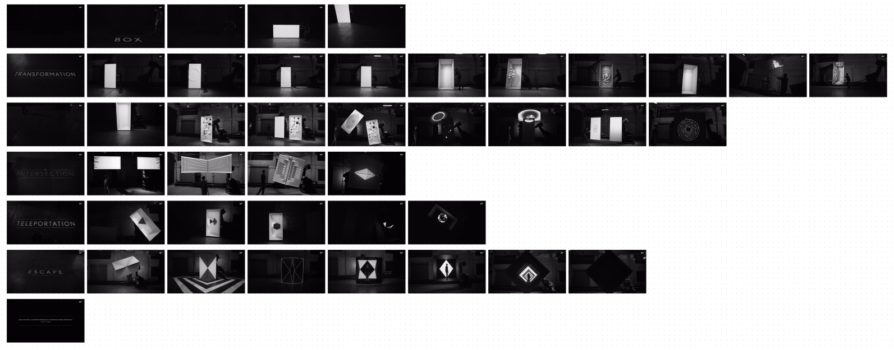

# convert-video-to-gif-clips

Python script that converts .mp4 videos to multiple .gif clips.

## Uses

- Grab small looping clips for teaching.
- Pull the best clips from your projects to feature in Capability Decks.
- Extract .gif from reference for Mood Boards.

## Author(s)

- [Donovan Keith](https://www.donovankeith.com)
- [Chat GPT](https://chat.openai.com)

## Requirements

- [Python 3+](https://www.python.org/downloads/)
- [FFmpeg](https://ffmpeg.org/)

## Quickstart

### Warning

DO NOT USE WITH REALLY LONG VIDEOS

1. Trim long movies down to the sections you're most interested in.

### Instructions

1. Copy this script into a directory where you want to convert your files.
2. Open terminal and `cd` to the directory.
3. `python3 convert-mp4-to-gif-clips.py -i INPUT.mp4`
4. Navigate to the new `gifs/` directory next to your input file.
5. Use Quick Look (spacebar on Mac) and your up/down arrow keys to quickly audition the clips you want to use.
6. Ctrl+C to copy, then Ctrl+V to paste in Google Slides or your 

## Usage

```
convert-mp4-to-gif-clips.py -i INPUT_FILE
                            [-o OUTPUT_FILE]
                            [-spacing CLIP_SPACING]
                            [-duration CLIP_DURATION]
                            [-w WIDTH]
```

## Why?

I teach Motion Design at California Institite of the Arts. It's helpful to breakdown longer animations into shorter clips.
I'm posting this here in case anyone else doing motion design needs to assemble decks/boards featuring the best clips from their own work.

## Inspiration

[BOX](https://www.youtube.com/watch?v=lX6JcybgDFo)
by
Bot & Dolly and [GMUNK](https://gmunk.com/BOX)

👆🏻 This video is so incredible that I just had to break it down into a series of 3 second clips so that I could watch each of the transitions over and over again.



## Questions / Support?

USE AT YOUR OWN RISK.

Sorry to say, but I likely won't be able to offer much in the way of support, nor respond to feature requests.
Feel free to add an issue, fork, fix, and pull request. I'll try to integrate when I've got some down time.

## References

- [GIPHY Engineering | » How to make GIFs with FFMPEG » How to make GIFs with FFMPEG](https://engineering.giphy.com/how-to-make-gifs-with-ffmpeg/): Reference for FFmpeg settings.
- [Video Downloader for Vimeo - Chrome Web Store](https://chrome.google.com/webstore/detail/video-downloader-for-vime/cgmcdpfpkoildicgacgldinemhgmcbgp/related?hl=en): Useful for grabbing videos from YouTube/Vimeo.

## AI Notice

This script was written in collaboration with ChatGPT.
